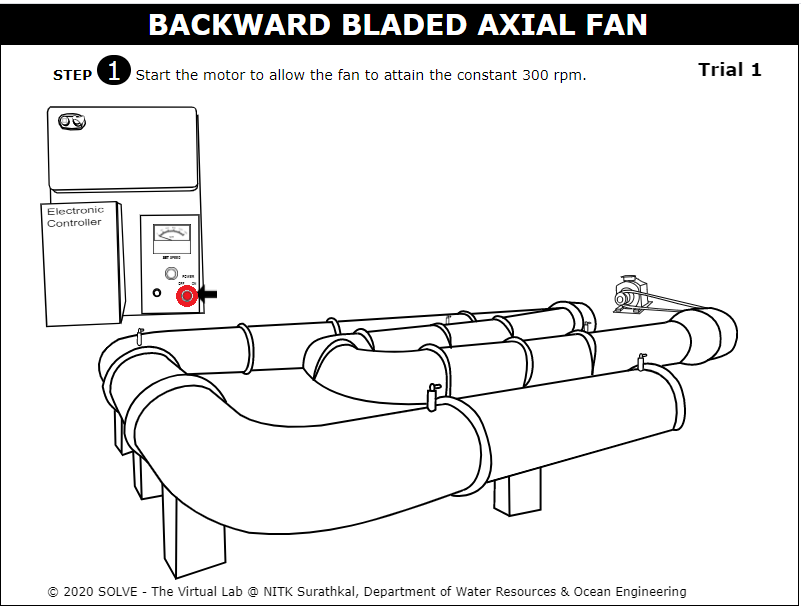
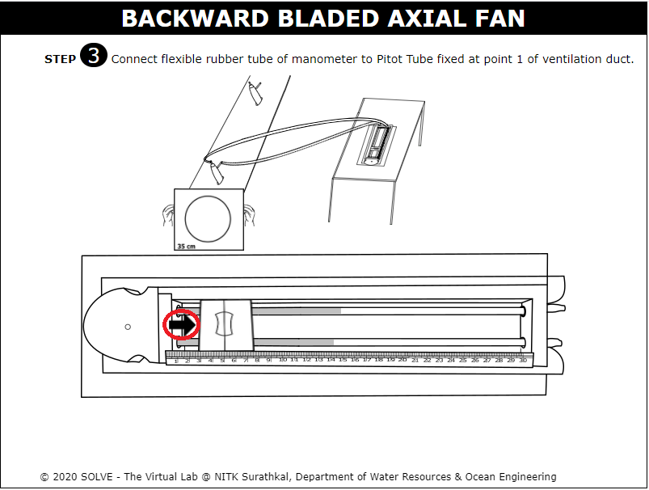
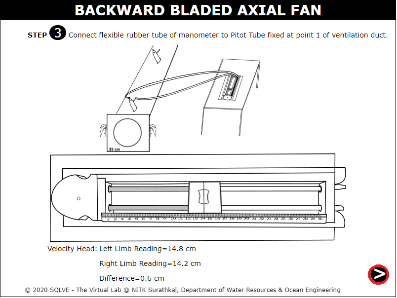
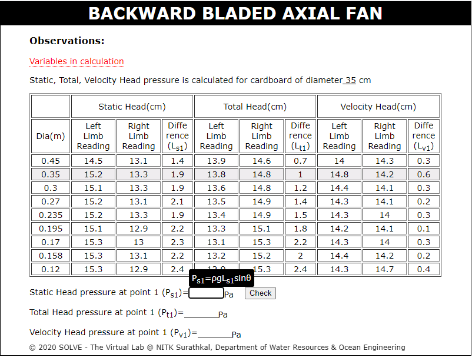

##### These procedure steps will be followed on the simulator

1. When you click on a Resistance and k-factor in the ventilation duct file, a new window will open as shown below.  
 

2. Click on the slider to rotate so that current comes in the circuit board. Click on the NEXT button at the bottom right corner to proceed to the next step. 
 

3. Click on the power button to start the motor.  
 

4. Click on the knob to set rpm of 300 and click on the NEXT button at the bottom right corner to proceed to the next step. 
 

5. Click on the hand to measure the inclination of manometer. 
 

6. Click on the DROPDOWN to answer the question. 
 

7. Click on the NEXT button at the bottom right corner to proceed to the next step. 
 

8. Click on the DROPDOWN to answer the question. 
 

9. Click on the NEXT button at the bottom right corner to proceed to the next step. 
 

10. Click on the OK button. 
 

11. Click on the hand to connect the rubber tube of manometer with pitot tube at point 1. 
 

12. Click on the big hand to take static head reading from manometer. 
 

13. Repeat the procedure no 11 and 12 for taking reading of total head and velocity head at point 1 in ventilation duct. Click on the NEXT button at the bottom right corner to proceed to the next step. 
 

14. The observation for point 1 is given below and put the required value in calculation to check your results. 
 

15. Click on the NEXT button at the bottom right corner to proceed to the next step. 
 

16. Click on the hand to connect the rubber tube of manometer with pitot tube at point 2. 
 

17. Click on the big hand to take static head reading from manometer. 
 

18. Repeat the procedure no 16 and 17 for taking reading of total head and velocity head at point 1 in ventilation duct. . Click on the NEXT button at the bottom right corner to proceed to the next step. 
 

19. The observation for point 2 is given below and put the required value in calculation to check your results. 
 

20. Click on the NEXT button at the bottom right corner to proceed to the next step. 
 

21. Click on the NEXT button at the bottom right corner to proceed to the next step. 
 

22. Now you can see the result in the last step. 
 

