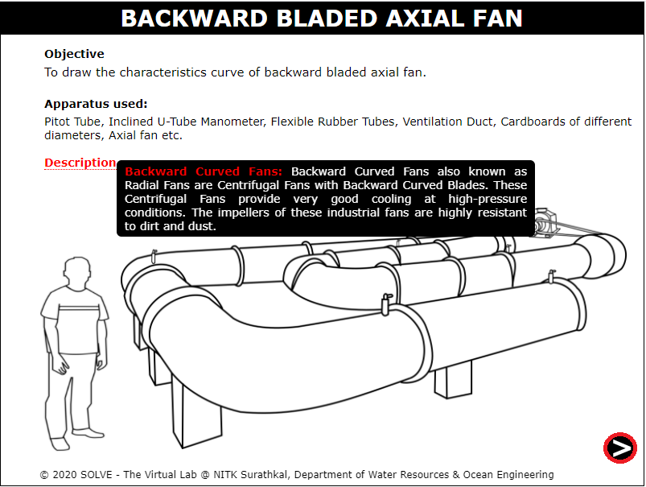
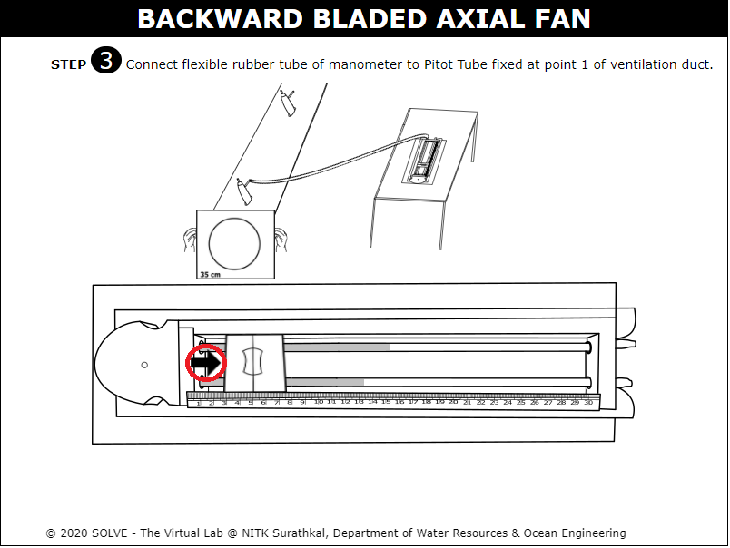
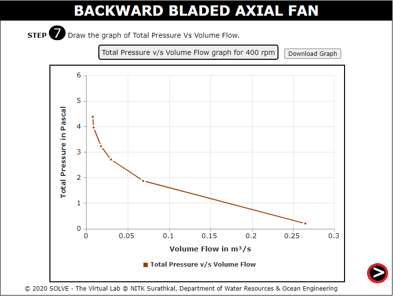

##### These procedure steps will be followed on the simulator

1. Prepare the setup for the  objective and click on the description to read it. Press the arrow at the bottom to proceed for the experiment. 
 

2. Now, press the start button to start the motor. 
 

3. Press the button to start the motor.  
 

4. Rotate the knob to set RPM of the axial fan. 
 

5. Measure the angle of inclination of the Inclined U- Tube manometer. And click on the hand to continue the experiment. 
 

6. Click on the corner below arrow to proceed next. 
 

7. Take the following precautions before taking the reading. And click the OK button to continue the experiment. 
 

8. Connect the rubber tube to the static head and take the readings. 
 
 

9. Now, connect the rubber tube to total head and take the readings. 
 

10. This time connect the rubber tubes to the velocity head and take the readings. 
 

11. After this repeat the same process for the 8 more trials .And click on the bottom arrow to proceed for the further readings and click on the below arrow to proceed next. 
 

12. Prepare the observation table for the experiment. Check the required values by inputting the data. 
 

13. When result comes true after checking, press the arrow for further process. 
 

14. Plot graph of Axial load Vs Penetration. 
 

15. Observe the nature of graph and click on the below arrow to proceed next. 
 

16. Repeat the same process for the speed of 400 RPM. 
 

17. We will get graph for 400rpm similar to 300rpm and click on the arrow to proceed next. 
 

18. 19.	Click on the refer graph to see graph at 300 and 400 rpm. Results and conclusion are given below 
 

