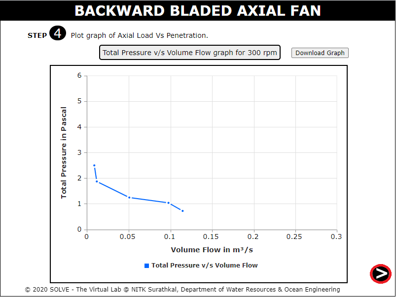

##### These procedure steps will be followed on the simulator

1. When you click on a Backward bladed axial fan file, a new window will open as shown below. 
 

2. Click on the slider to rotate so that current comes in the circuit board.  
 

3. Click on the power button to start the motor.  
 

4. Click on the knob to set the motor to 300 rpm. 
 

5. Click on the hand to measure the inclination of manometer. 
 

6. Click on the NEXT button to proceed to the next step. 
 

7. Take the following precautions before taking the reading. And click the OK button to continue the experiment. 
 

8. Keep the cardboard in front of the ventilation duct. And click on the hand to connect the rubber tube of manometer with pitot tube at point 1. 
 

9. Click on the mover to take the static head reading from manometer.
 

10. Now, connect the rubber tube to pitot tubes total head and take the readings. 
 

11. This time connect the rubber tubes to the pitot tubes velocity head and take the readings. 
 

12. After this repeat the same procedure for the 8 more trials. And click on the NEXT button to proceed for the further readings   
 

13. click on the NEXT button to proceed to the next step.
 

14. Prepare the observation table for the experiment. Check the required values by inputting the data. 
 

15. When result comes true after checking, press the arrow for further process. 
 

16. Plot graph of Axial load Vs Penetration for 300 rpm. 
 

17. Observe the nature of graph and click on the NEXT button to proceed to the next step. 
 

18. Repeat the same procedure for the speed of 400 rpm. 
 

19. We will get graph for 400rpm similar to 300 rpm and click on the NEXT button to proceed to the next step. 
 

20.	Click on refer graph to see graph at 300 and 400 rpm. Results and conclusion are given below 
 

