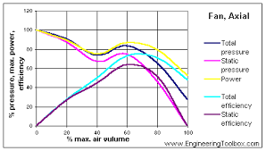
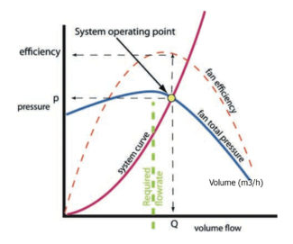
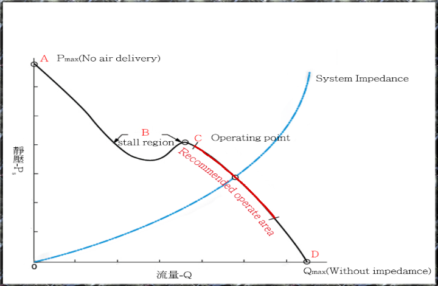
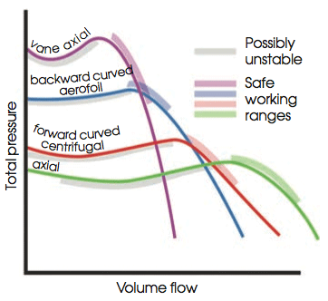

### INTRODUCTION 

#### Pitot Static Tube

 For every speed of a fan, a set of curves can be drawn to show variations of fan drift pressure, B. H. P. (Brake horsepower) of the prime mover and mechanical efficiency of the fan, with the change in volume of air circulated by it. These curves are indicative of the performance or 'characteristics of the fan' and as such, referred to as fan characteristics curves of that particular fan. Sometimes the term "fan characteristics" is used to denote the pressure-volume curve.

Characteristics curve can be used:

<ol style="text-indent:50px;text-align:justify;list-style-position: inside;">
<li>To assess the efficiency of the construction of a fan.</li>
<li>To compare two or more fan.</li>
<li>To choose the most efficient fan for a given mine resistance.</li>
<li>To anticipate change in performance of a fan with a change in mine resistance.</li>
<li>To choose a prime mover of suitable power and type.</li>
<li>To know the performance of a combination of fans in series or in parallel, by compounding curves of the individual fans.</li>
</ol>

Characteristics curve of various type of fans:

<ol style="text-indent:50px;text-align:justify;list-style-position: inside;">
<li>
The pressure characteristics of the pressure-volume curve of a backward bladed fan falls fairly steadily from a maximum pressure at low volume to zero at volume, while that of a forward bladed fan remains relatively constant for a wide range of volume but falls steeply as the maximum volume is reached.

In case of axial flow fan maximum water gauge is developed at zero volume and not at the low volume as in the other two cases.

</li>
<li>
The power characteristics or the B.H.P curve of a backward bladed fan is almost a rising straight line passing above the origin, tending to flatten and then to fall with increasing volume, thereby showing that power increase with increased volume, but once the maximum volume is reached, power becomes almost constant and then decreases. Thus it indicates the non-overloading feature of the backward bladed fan.

Power characteristics of a forward bladed fan rise steadily at low volume but steepen at high volumes with a decrease of mine resistance for any region, i.e. if the volume of airflow increases, the motor will be overloaded. Hence an electric drive is unsuitable for a forward blading centrifugal fan when there is a chance of sudden short-circuiting or sudden change in mine resistance.

</li>

<li>
The efficiency characteristics of radial flow fan of both forward and backward bladed time is asymmetrical curve rising steeply from zero at zero volume to a broad topped maximum and falling again steeply to zero at maximum volume.

Efficiency characteristics of axial flow fan differ valuation from the other two types. It shows the general rise in efficiency from zero to a sharp peak, followed by a rapid drop. It indicates that this fan is suitable only in mine works whose resistance varies within narrow limits.

A mine characteristic is a curve showing the pressure quantity relationship of the mine, that is, it indicates what quantity of air will pass through the mine when the given pressure is applied across the mine opening, or vice versa. It is the curve of equation P=RQ2, where R is the resistance of the mine. Such a curve for roadways is called the characteristic curve of that roadway.

The point of intersection of the mine characteristic with the pressure-volume curve of the mine, when both of them are plotted on the same scale, gives an " operating point" which indicates the pressure and volume for which the fan is automatic but suited. If the corresponding efficiency figure lies near the apex of the efficiency curve, the fan will work efficiently and economically.

</li>
</ol>

  

Characteristics curve of axial fan.
 

Source: (<a href="https://www.engineeringtoolbox.com/fan-types-d_142.html">https://www.engineeringtoolbox.com/fan-types-d_142.html 
</a>)

  

  

Characteristics curve representing operating point
 

Source: (<a href="https://www.axair-fans.co.uk/all-technical-information/duty-point-operating-point/">https://www.axair-fans.co.uk/all-technical-information/duty-point-operating-point/
</a>)

  

  

Characteristics curve showing stall region.
 

Source: (<a href="http://www.honsan-tech.com.tw/Web/EN/Technical%20Information_Impedance%20Curve-en1.html">http://www.honsan-tech.com.tw/Web/EN/Technical%20Information_Impedance%20Curve-en1.html
</a>)

  

  

Characteristics curve of different fan.
 

Source: (<a href="https://www.cibsejournal.com/cpd/modules/2011-12/">https://www.cibsejournal.com/cpd/modules/2011-12/
</a>)

 